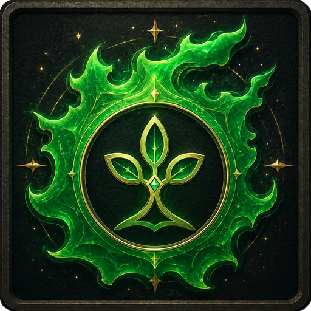
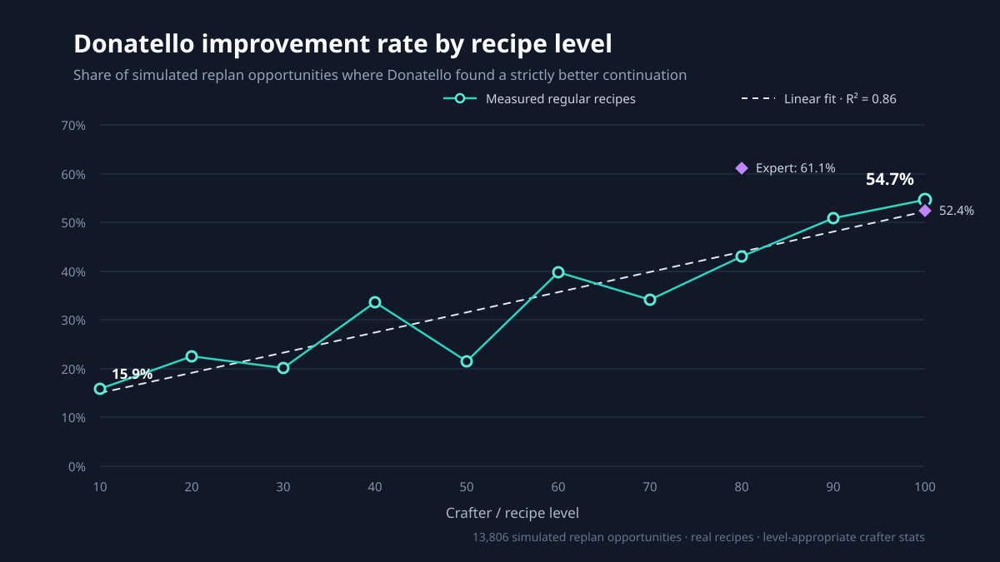

<p align="center">
  <a href="https://github.com/slobodaapl/GatherBuddyAscended">
    
  </a>
</p>

<h1 align="center">GatherBuddy Ascended</h1>

[](https://github.com/slobodaapl/GatherBuddyAscended/releases/latest)

[](LICENSE)

GatherBuddy Ascended is a Dalamud plugin for Final Fantasy XIV gathering and crafting automation.
It continues from [GatherBuddy Reborn](https://github.com/FFXIV-CombatReborn/GatherBuddyReborn),
preserves its established gathering workflows, and provides a home for deeper crafting integration,
quality-of-life work, and future features beyond the Reborn baseline.

## Current features

### Gathering

- Automated BTN/MIN gathering and navigation.
- Resource lists and queued gathering goals.
- Timed-node, weather, fishing, and spearfishing tools.
- Vendor, marketboard, retainer, and material-source support used by crafting workflows.

[vnavmesh](https://github.com/awgil/ffxiv_navmesh) is required for automated navigation.

### Crafting

- Crafting lists, material planning, consumable handling, repairs, and queue execution.
- **Donatello** is the default crafting solver. Standard Solver, Raphael, Progress Only, and user
  macros remain available.
- Donatello combines Raphael's global optimization with live-state replanning. It reacts to expert
  craft conditions, current CP/durability/progress/quality, active effects, combos, and specialist
  charges, then optimizes the complete remaining craft.

### Donatello benchmark

We replayed Raphael plans, injected every supported observed condition at every action boundary,
and asked Donatello to optimize the same remaining craft.



Across every tested level bracket, Donatello had a non-zero chance of finding a better continuation.
Its measured effectiveness rises with recipe difficulty (linear fit $`R^2 = 0.86`$), so the benefit is
expected to grow as the game adds higher-level recipes. At level 100, Donatello found a strictly
better solution in approximately 55% of simulated replan opportunities.

| Corpus | Scenarios | Better plans | Equivalent plans | Worse plans | Solver failures |
| --- | ---: | ---: | ---: | ---: | ---: |
| Quick | 270 | 97 | 161 | 12 | 0 |
| Full action set | 189 | 55 | 133 | 1 | 0 |

Every selected Donatello plan completed its craft. Worse plans are discarded and replaced by standard solve any time they're detected, as such it's safe and cannot fail. The benchmark is reproducible from the [`donatello-bench`](donatello/donatello-bench) crate.

## Direction

GatherBuddy Ascended continues beyond GatherBuddy Reborn with Donatello and ongoing quality-of-life improvements.

## Installing

Add this URL under `/xlsettings` → **Experimental** → **Custom Plugin Repositories**:

```text
https://slobodaapl.github.io/GatherBuddyAscended/pluginmaster.json
```

GatherBuddy Ascended will then appear in the Dalamud Plugin Installer. Install and configure
[vnavmesh](https://github.com/awgil/ffxiv_navmesh) for automated navigation.

## Building

Clone recursively so all pinned dependencies, including Donatello, are present:

```text
git clone --recurse-submodules git@github.com:slobodaapl/GatherBuddyAscended.git
```

Release CI builds the .NET plugin plus the pinned native `donatello_ffi.dll`, then packages
them as `GatherBuddyAscended.zip`.

## Contributing

1. Fork the repository and clone it recursively.
2. Keep changes scoped and preserve unrelated behavior.
3. Build and test affected .NET and Rust components.
4. Open a pull request against `main` with behavior, evidence, and known limitations described.

## Attribution and acknowledgements

GatherBuddy Ascended builds on substantial prior work. Attribution does not imply endorsement:

- Contributors to Dalamud and FFXIVLauncher.
- [Artisan](https://github.com/PunishXIV/Artisan): Taurenkey, pksage, Limiana, and contributors.
- [GatherBuddy](https://github.com/Ottermandias/GatherBuddy): Ottermandias and contributors.
- [GatherBuddy Reborn](https://github.com/FFXIV-CombatReborn/GatherBuddyReborn): the Combat Reborn team and contributors.
- [Raphael XIV](https://github.com/KonaeAkira/raphael-rs): KonaeAkira and contributors; foundation of the pinned Donatello solver fork.
- [vnavmesh](https://github.com/awgil/ffxiv_navmesh): awgil, xanderscore, and contributors.
